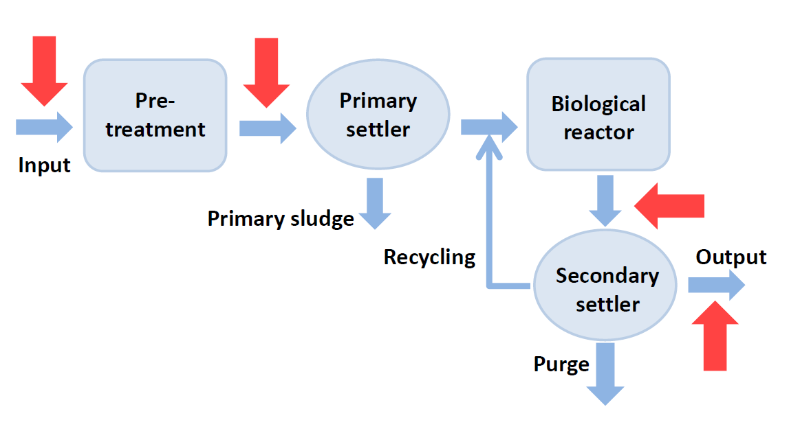
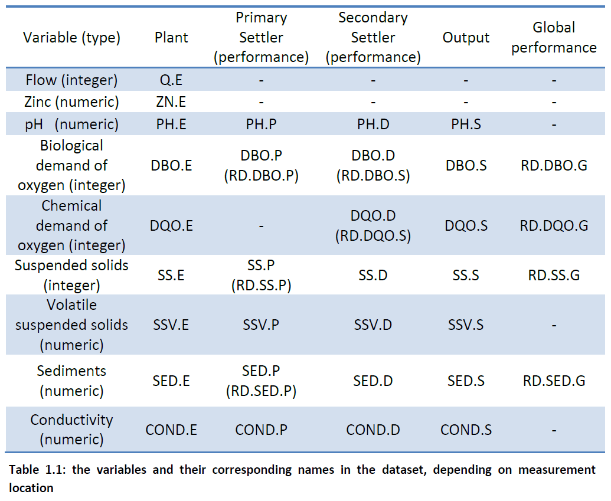
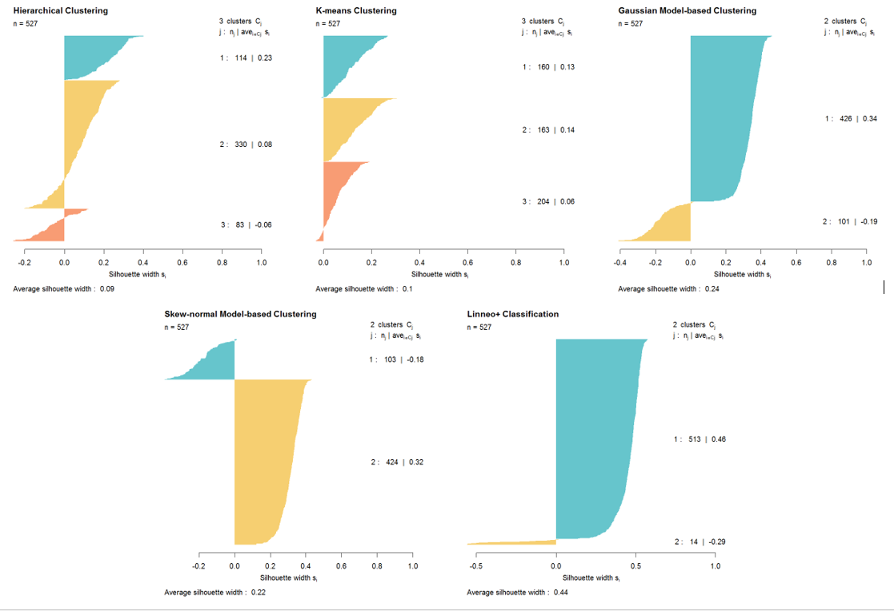
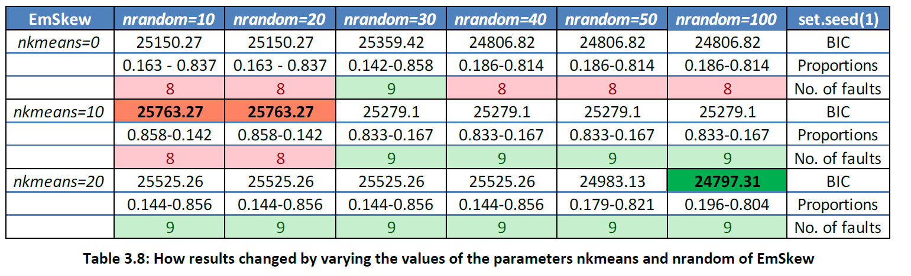
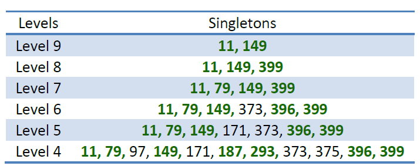
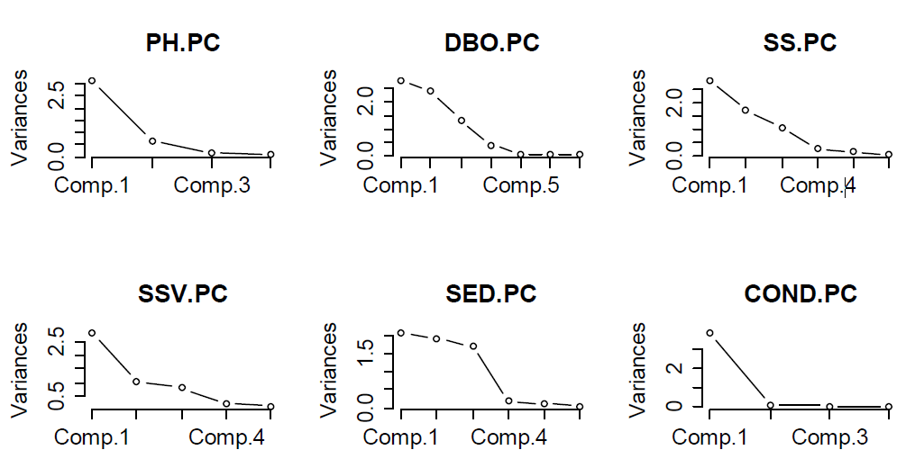
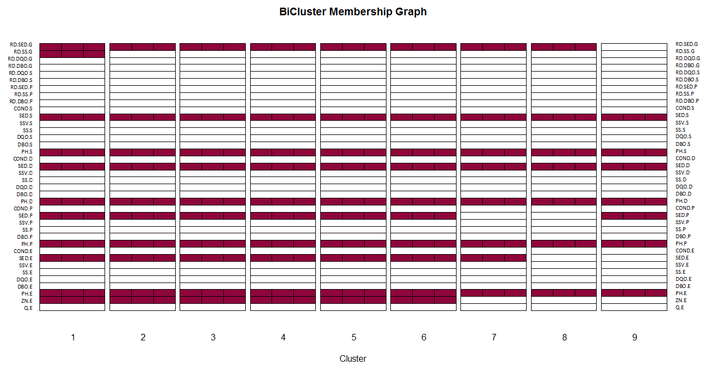

```{r setup, include=FALSE}
library(rmdformats)
library(kableExtra)
knitr::opts_chunk$set(echo = TRUE)

library(tidyverse)
theme_set(theme_light())
library(GGally)
library(ggpubr)
library(useful)
library(here)

bi_density_plot <- function(data, mapping, palette = 4, ...){
  # https://stackoverflow.com/questions/13094827/how-to-reproduce-smoothscatters-outlier-plotting-in-ggplot
  p <- ggplot(data, mapping = mapping) +
    theme_void() +
    scale_x_log10() + 
    scale_y_log10() + 
    stat_density2d(geom = "tile", aes(fill = ..density..^0.25, alpha = 1), contour = FALSE) + 
    geom_point(size=0.5) +
    stat_density2d(geom = "tile", aes(fill =..density..^0.25, alpha=ifelse(..density..^0.25<0.4,0,1)), contour = FALSE) + 
    scale_fill_gradientn(colours = colorRampPalette(c("white", blues9))(256))
  p
}

histogram_density <- function(data, mapping, mean, sd, title, ...){
  p <- ggplot(data, mapping = mapping) +
    geom_line(aes(y = ..density..), stat = 'density', 
              colour = "black", size = 1) +  
    geom_histogram(aes(y = ..density..), alpha = 0.4) +
    stat_function(fun = dnorm, 
                  args = list(mean = mean, sd = sd),
                  col = "navy", size = 1) +
    theme(legend.position = "none") +
    labs(title = title)
  p
}

multiKmeans <- function(data,max.clusters,iter){
  # cluster sum of squares
  css = list()
  km = list()
  for(i in seq(2:max.clusters)){
    cl = NULL
    cl = kmeans(data,centers=i,iter.max=iter)
    css[i]=cl$tot.withinss
    km[[i]]=cl 
  }
  df = data.frame(ss=matrix(unlist(css), nrow=max.clusters-1, byrow=T))
  cluster = seq(2,max.clusters)
  df = cbind(df,as.data.frame(cluster))
  return(list(css=df,cluster=km))
}

elbowGraph <- function(multiKmeansObj){
  require(ggplot2)
  p = NULL
  p = qplot(x=as.numeric(cluster),y=ss,data=multiKmeansObj)
  p = p + geom_point(colour = "red", size = 2) + geom_text(aes(label=as.numeric(cluster),size=1,hjust=-0.5, vjust=0))
  p = p + labs(title = "Elbow Graph") + xlab("# of Clusters") + ylab("Sum of Squares") + theme_bw()
  p = p + theme(legend.position = "none")
  return(p)
}

load(here("workspace.RData"))
```

The content of this report comes from my Bachelor's thesis project. To cite the work, please refer to Geminiani (2014) _A comparison of clustering methods for determining the operational states of a wastewater treatment plant_ . [Unpublished BS.c dissertation] Alma Mater Studiorum, University of Bologna.

# Introduction

Our planet is characterized by a large amount of water. However, only 3% of the available water resources are freshwater. Most of this water can be found in polar ice caps and glaciers, and only the minority comes from aquifers and surface waters (i.e., lakes, rivers, and streams). The latter represents only 0.0091% of the total water on the planet, but they are intensively processed to make them suitable for human consumption.

<center>

</center>

<br>

Wastewater is sewage, stormwater, and water used for various purposes around the community and can be generated from both residential and non-residential sources. Unless properly treated, wastewater can harm public health and the environment. Here comes the need to have wastewater treatment plants, which are essential for preserving the ecological equilibrium of water bodies and completing the urban wastewater cycle by clearing and returning it to rivers or cities in proper conditions to be used by human beings for their daily activities.

<center>

</center>

<br>

The treatment plant studied in this project is located in Manresa, a town of about 75000 inhabitants near Barcelona, and it is the first plant of the Recovery Plan of Catalonia. Aigües de Manresa, S. A. (a municipal corporation) provides citizens with high-quality services by managing the sewer service, the drinking water supply and the collection, the storage, the evacuation, the sanitation (sanitary control) and the treatment of the wastewater of Manresa and the surrounding areas. The nearby laboratory services are involved with collecting samples and carrying out analyses to improve the quality of the water.

This urban wastewater treatment plant uses a process known as activated sludge to remove biological and chemical waste products from water so that the treated water can be used for other purposes. Thanks to several microorganisms and the dissolved oxygen supplied by an aeration system, biodegradable pollutants can be transformed into new biomass.

The plant is constituted by a primary settler, a biological reactor, and a secondary settler. After the biological reactor, where the level of substrate is reduced by the action of microorganisms, the water flows to the secondary settler where the biomass sludge settles. Clean water hence remains at the top of the settler and can be easily carried out of the plant. A portion of the sludge is returned to the bioreactor's input to maintain an appropriate level of biomass, allowing the oxidation of organic matter, while the rest of the sludge is purged.

<center>

</center>

<br>

Promptly recognizing when the plant's faults occur is extremely important for healthcare, which is why this dataset of 39 variables, referring to 527 consecutive days, was created. The data come from the [UCI Machine Learning Repository](https://archive.ics.uci.edu/ml/datasets/Water+Treatment+Plant), a collection of databases, domain theories and data generators that are used by the machine learning community for the empirical analysis of machine learning algorithms.

This dataset, called [_Water Treatment Plant Dataset_](https://archive.ics.uci.edu/ml/datasets/Water+Treatment+Plant), has already been analyzed by a knowledge acquisition tool, Linneo+ (Béjar Alonso, Poch Espallargas, Cortés, 1993), which works incrementally with an unsupervised learning strategy and then uses information about the domain elements (domain theory) to induce classes and bias the results. This method is called _conceptual clustering_  because a concept description is provided for each distinguished class.

In the literature, it is common practise to predict faults through such methods taking advantage of external information; however, this information is not always available when the faults need to be identified. In addition, the authors of Linneo+ did not make public the a priori knowledge nor the details of their results. However, it was clearly stated when the malfunctioning days occurred, therefore we relied on this information to assess whether the clustering algorithms managed to detect the faults.

This project aims to use data-based methods to properly diagnose the faults of the plant. More specifically, we are interested in:

* Classifying the wastewater treatment plant's operational state and hence predicting faults through the state variables at each stage of the treatment process.

* Understanding how the existing clustering methods perform in the analysis of the dataset.

* Assessing whether variable selection improves clustering. 


### The Dataset

Given the social relevance of these plants, many variables related to the organic matter and the microorganisms have been measured, thus providing a highly multivariate dataset.

The 38 variables that compose the dataset (plus an additional variable indicating the day of measurement) are a set of system variables measured in several parts of the plant (at the input, after the pre-treatment, at the input of the biological reactor, and at the water output of the plant) with a daily frequency. Eight of them are quality indicators, and nine of them are percentages of performance. The measured quantities are:

* **Flow to the plant**: a plant must be able to handle fluctuations in the quantity and quality of the wastewater it receives to ensure that proper treatment is granted at all times because peaks vary according to different times of the day and days of the week.

* **Zinc**: it is a heavy metal present in wastewater as a pollutant and hence has to be removed.

* **pH**: it is the measure of the inverse concentration of hydrogen ions, and it is a crucial quantity because the acidity (low pH) or alkalinity (high pH) of wastewater affects the treatment and the environment. It should be between 6 and 9 to protect beneficial organisms.

* **Biological oxygen demand** (BOD): it is used to indicate the organic quality of water and the effectiveness of wastewater treatment plants. It quantifies the milligrams of dissolved oxygen needed by aerobic microorganisms in a water body to break down in the dark the organic material present in a liter of water at 20 °C in 5 days of incubation.

* **Chemical oxygen demand** (COD): it is an indirect measure of the number of organic pollutants in wastewater and a useful indicator of water quality. It represents the amount of oxygen necessary for the complete chemical oxidation of organic and inorganic components in a water sample. It is sometimes preferable to the BOD because it is faster to get and less error-sensitive during the measurement procedure.

* **Suspended solids**: they are small solid particles that remain in suspension in the wastewater when passed through a filter and constitute nearly 30% of the solids included in it. They are eliminated from the wastewater using sedimentation and filtration procedures so that water can become drinking water.

* **Volatile suspended solids**: they are the part of the total solids that is lost when the total solids are heated at high temperatures (the part that remains is called “suspended solids”)

* **Sediments**: they are solid particles entrained by the turbulence of moving water and are removed thanks to settling basins during the sedimentation process.

* **Conductivity**: it measures the ability of an electrolyte solution to conduct electricity and is used to monitor water purification systems' performance.

<center>

</center>


# Methods

In this section, we review the statistical methods that have been applied in the data analysis.

## Data transformation

Data transformations are commonly used to improve the normality distribution of the variables, the validity of their association measures, and equalize their variances. As such, they are an important aspect of data cleaning. Even in the presence of “robust” analyses or non-parametric tests, attending to this issue can improve the results, especially when substantial non-normality is present (Zimmerman, 1995).

Box Cox transformations are a family of power transformations that help to find the optimal normalizing transformation for each variable, eliminating the need to randomly try different transformations to determine the best option, provided that the variables are strictly positive. The Box and Cox transformation for a power parameter $\lambda$, estimated using maximum likelihood, is described as:

$$
\begin{equation}
y_i^{\lambda} =
\begin{cases}
\dfrac{y_i^{\lambda} - 1}{\lambda} & \text{if } \lambda \ne 0 \\[0.2cm]
\log(y_i)                          & \text{if } \lambda =   0
\end{cases}
\end{equation}
$$

When $\lambda = -1$ the inverse transformation is applied, when $\lambda =0$ it is the logarithmic transformation, when $\lambda =1$ no transformation is needed, whereas when $\lambda = 0.5$ the square root transformation is applied.


## Missing data

One of the problematic characteristics of this dataset is the large presence of missing values. About 27% of the observations had at least one missing value. Among the observations with missing information, there were also 8 faulty days (out of 14). If these observations were omitted, much information about the data would be lost with the risk of missing possible structures and patterns.

We thus imputed the missing data by a non-parametric method known as *k-nearest neighbors*. It aims to estimate the missing values contained in a dataset based on the similarity between the statistical unit with missing entries and the $k$ closest observations. This similarity is evaluated by computing the Euclidean distance between the observations and $k$ is an integer representing how many nearest neighbors should be taken into account.

Hence, an important choice is the value of $k$, which determines the observations with the closest profile to the unit containing the missing value. The missing value is computed as a weighted average of the k-values in that sample of neighbors so that only the nearest neighbors contribute. Of course, any imputation carries over some risks and may impact the result. We will furtherly discuss this in the concluding section.

## Clustering

Given a set of elements with a vector of attributes, clustering aims to partition the data into disjoint sets, called clusters, so that within each set the attribute vectors are similar, while vectors of disjoint sets are dissimilar. Its purpose is to identify groups of similar objects and discover interesting distributions and patterns in large datasets.
Many decisions must be made, including the choice of the clustering method, the definition of “dissimilarity”, and several a priori assumptions.

### Dissimilarity measure

Units on which numeric variables only have been measured can be aggregated through two types of distances:

* The **Euclidean** distance for two objects *i* and *j* in the *p*-dimensional space is computed as $d_{ij} = \sqrt{\sum_{k = 1}^p (x_{ik} - x_{jk})^2}$. By using squares, it gives more weight to variables with larger differences, i.e. two observations are treated as less similar if there is a very large dissimilarity on one variable and small dissimilarities on all variables. However, all variables are given the same importance and the fact that there may be correlation between them or that there may be differences in the variances is neglected.

* The **Manhattan** distance for two objects *i* and *j *in the *p*-dimensional space is computed as $d_{ij} = \sum_{k = 1}^p | x_{ik} - x_{jk} |$. It is the sum of the absolute differences of the Cartesian coordinates of the two points.

When the variables have been standardized, the two distance measures are almost equal. In this project, we used the Euclidean distance as a measure of the dissimilarity between units.

### Hierarchical clustering

Hierarchical clustering proceeds successively by either merging small clusters into larger ones, or by splitting larger clusters. The result is the dendrogram, a tree of clusters which shows how the clusters are related. By cutting it at a desired level, a clustering of the data items into disjoint groups is obtained. We use agglomerative algorithms, which produce a sequence of clustering schemes with a decreasing number of clusters at each step. The clustering scheme produced at each step results from the previous one by merging the two closest clusters. The differences among the various approaches lie in the evaluation of the dissimilarity between clusters:

* **Single linkage**: the distance between two clusters is defined as the minimum distance between the two closest points, one belonging to the first cluster and the other to the second one. It is a good method when clusters look well separated, but not in presence of overlapping clusters, because of the so called “chaining effect” (i.e., in order to merge two clusters, only two similar observations from two different clusters are required). Clusters obtained with this method tend to have a long and narrow shape and be internally poorly homogeneous. The dendrogram is characterized by short branches.

* **Complete linkage**: the distance between two clusters is defined as the maximum distance between the two furthest points, one belonging to the first cluster and the other to the second one. The obtained clusters are spherical and the dendrogram has longer branches because the clusters form at larger distances.

* **Average linkage**: the distance between two clusters is defined as the average of all the dissimilarities between pairs of points one from each cluster. The detected clusters are more homogeneous and well distinguished.

* **Centroid linkage**: the distance between two clusters is defined as the Euclidean distance between the two cluster centres (the cluster centre is the mean vector of the observed variables in a certain cluster). A problem that may be encountered with this approach is that, as a consequence of the fact that the centre will move as clusters are merged and that some units may need to be switched from their original clusters, the distance between merged clusters may decrease between steps, making the results less interpretable. The identified clusters have a spherical shape.

* **Ward’s method**: the distance between two clusters is defined as the deviance between the two clusters. It joins groups that do not increase the overall heterogeneity too much. The aim is to unify the groups such that their merging implies the smallest increase of the “deviance within” the whole partition. It identifies spherical homogeneous clusters of similar sizes.


*Additional considerations*: Each partition in *k* groups is optimal in a step-wise sense: it is the best partition in $k$ groups, given the partitions in $k+1$ groups defined at the previous step. Moreover, when two clusters are merged, they remain so until the end of the hierarchy. This means that a mistake committed in the initial phase of the classification can never be corrected, which may be a serious drawback. However, they are more efficient in handling noise and outliers than partitioning algorithms, even if they break down due to their non-linear time complexity.

### Partitioning clustering

Partitioning clustering methods directly decompose the dataset into a set of *k* disjoint clusters, giving rise to a single partition, for this reason the number of clusters has to be specified in advance. Applicable mainly to numerical datasets, they are unable to handle noise and outliers and not suitable to discover clusters with non-convex shapes.

K-means algorithm is one of the most popular partitioning clustering methods and its aim is the optimisation of an objective function that attempts to minimize the distance of each point from the center of the cluster to which the point belongs. The algorithm begins by initialising a set of *k* cluster centers, then it assigns each observation to the cluster whose center is nearer, and recomputes the centers. The process continues until the centers of the clusters stop changing. It computes the centroid vector for each cluster according to the criterion of minimizing the mean squared distance between the original vectors and the centroid vectors.

### Mixture Model-based clustering

Model-based clustering is based on the idea that the observed data come from a population with several subpopulations. The general idea is to model each of the subpopulations separately and the overall population as a mixture of these subpopulations, using finite mixture models. The general form of a finite mixture model with *G* groups is $f(\boldsymbol x) = \sum_{g=1}^G \pi_g f_g(\boldsymbol x)$, where $\pi_g$ is the proportion of the population in the $g$-th group and $f_g(\cdot)$ is the probability density function for the $g$-th group. The subpopulations are often modelled by members of the same parametric density family, in which case the finite mixture model can be written as $f(\boldsymbol x) = \sum_{g=1}^G \pi_g f(\boldsymbol x|\boldsymbol \phi_g)$, where $\boldsymbol \phi_g$ is the parameter vector for the $g$-th group.

The mixture model can be used to partition the data into clusters using the optimal (Bayes) rule for classification. This classifies observation $x$ to cluster $g$ if the posterior probability that it belongs to group $g$ (i.e. the posterior probability of each mixture component given a data point) is greater than the posterior probabilities that it belongs to any other group; points associated with the same component form one cluster. The model parameters are estimated by the Expectation-Maximisation algorithm (Dempster et al., 1977).

Model selection methods that involve Bayes factors (i.e. the posterior odds for a model $M_1$ against a model $M_2$ when their prior model probabilities are equal) are used to decide the number of clusters. Because of the difficulty in computing them, Bayes factors are approximated by

$$
BIC = 2 \log(\text{maximized log-likelihood}) - (\text{no. of parameters}) \log(n),
$$

where $n$ is the number of observations. Keribin (1998) showed the BIC to be consistent for the choice of the number of clusters; differences of less than 2 between BIC values are typically viewed as barely worth mentioning, while differences greater than 10 are regarded as strong evidence.

These algorithms can handle arbitrary shaped collections of points as well as clusters of different sizes and they efficiently separate noise (outliers). On the other hand, an obvious problem is that, as clusters are identified with the components of the mixture model, if the latter is not precisely true, clusters are no longer well defined.

Further advantages are that a probability distribution is obtained for each cluster and data of different characteristics can be handled. However, equating a component with a cluster may not always correspond to truth and the mixture components may not align with the hills of the density, especially in case of poorly separated clusters or of violation of the assumed parametric distribution.


#### Gaussian mixture model-based clustering

If the components of the mixture have a multivariate normal distribution, that is, $f(\cdot | \boldsymbol \phi_g) = MVN(\cdot | \boldsymbol \mu_g, \boldsymbol \Sigma_g)$, then a so called Gaussian mixture model is defined. The identified clusters are ellipsoidal, spherical and cylindrical and if all the observations have a normal distribution, with the identity matrix as covariance matrix, we get the $k$-means clustering. One practical issue with multivariate normal modelling of the components is that if the model is unconstrained, the number of parameters grows rapidly with the dimension and with the number of clusters, leading to a possible overfitting and degradation of performance.

One way of alleviating this is to impose restrictions on the covariance matrices. The covariance matrix can be decomposed, as was done by Banfield and Raftery (1993), as $\boldsymbol \Sigma_g = \lambda_g \boldsymbol D_g \boldsymbol A_g \boldsymbol D_g^T$, where $\lambda_g$ is the largest eigenvalue of $\boldsymbol \Sigma_g$ and controls the volume of the $g$-th cluster; $\boldsymbol D_g$ is the matrix of eigenvectors of $\boldsymbol \Sigma_g$, which controls the orientation of that cluster and $\boldsymbol A_g$ is a diagonal matrix with the scaled eigenvalues as entries, which controls the shape of that cluster.

By imposing constraints on the various elements of this decomposition, a large range of models is available, from the simple spherical models that have fixed shape to the least parsimonious model where all elements of the decomposition are allowed to vary across all clusters.

#### Skew-normal mixture model-based clustering

An approach to model-based clustering aimed to detect non-elliptical clusters makes use of skew-normal components (Lee, McLachlan, 2013). The term skew-normal refers to a parametric class of probability distributions which includes the standard normal as a special case.
A *p*-variate random vector $\boldsymbol Y$ has a multivariate skew-normal distribution if its density is given by:

$$
f(\boldsymbol y; \boldsymbol \mu, \boldsymbol \Sigma, \boldsymbol \delta) = 2 \phi_p(\boldsymbol y; \boldsymbol \mu, \boldsymbol \Sigma)\Phi_p(\boldsymbol \delta^T \boldsymbol \Sigma^{-1} (\boldsymbol y - \boldsymbol \mu); 0, 1 - \boldsymbol \delta^T \boldsymbol \Sigma^{-1} \boldsymbol \delta),
$$

where $\boldsymbol \mu$ is the location vector, $\boldsymbol \Sigma$ a scale matrix and $\boldsymbol \delta$ is the skewness vector. We let $\phi_p(\cdot;  \boldsymbol \mu, \boldsymbol \Sigma)$ be the $p$-variate normal distribution with mean vector $\boldsymbol \mu$ and covariance matrix $\boldsymbol \Sigma$, and $\Phi_P(\cdot; \boldsymbol \mu, \boldsymbol \Sigma)$ the corresponding distribution function.

As a generalization of the normal law, this distribution is a natural choice in all practical situations in which there is some skewness present. The level curves are not ellipsis anymore, but “drops” and the clusters identified are not spherical, as in $k$-means or in normal mixture models, but skew.

### Modal clustering

It is a non-parametric approach (Li, Ray, and Lindsey, 2007) that keeps the advantages of model-based clustering, but with the benefit that data are allowed to reveal a non-parametric distribution for each cluster and with the guarantee that every cluster accounts for a distinct hill (i.e. a bump) of the probability density. To avoid restrictions imposed by parametric assumptions, the data are modelled using Gaussian kernel density functions, which have a mixture structure.
The advantage of modal clustering is the greater flexibility because there is no identification between the mixture components of a distribution and the clusters, as in mixture-model-based clustering.

The Modal EM (MEM) algorithm finds an increasing path from any point to a local maximum of the density, that is, a hilltop and associates the data points to their modes. It comprises two iterative steps similar to the expectation and maximization steps in EM (Dempster et al., 1977), although it is quite different from the latter, as its aim is not to maximize the likelihood of the data over the parameters of an assumed distribution, but to find the local maxima of a given distribution.

Let a mixture density be $f(x) = \sum_{k = 1}^K \pi_k f_k(x)$, where $x \in \mathbb{R}^d$, $\pi_k$ is the prior probability mixture component $k$, and $f_k(x)$ is the density of component $k$. Given any initial value $x^{(0)}$, MEM solves a local maximum of the mixture by alternating the following two steps until a stopping criterion is satisfied. Start with $r=0$.

* Let $p_k = \dfrac{ \pi_k f_k (x ^{(r)})  }{f(x^{(r)})}$, for $k = 1, \ldots, K$.

* Update $x^{(r+1)} = arg max \sum_{k = 1}^K  p_k \log f_k (x)$.

In the “Expectation step” the posterior probability of each mixture component $k$, $1 \le k \le K$, at the current point $x^{(r)}$ is computed, while the “Maximization step” finds the log-density with weights equal to the posterior probabilities. With MEM two points are grouped together if they correspond to the same mode. Therefore, a hierarchy of clusters can be constructed by increasing the variances of the Gaussian kernels because when the bandwidth $\sigma$ increases, the kernel density estimate becomes smoother and more points tend to climb to the same mode.
Given a sequence of bandwidth, $\sigma_1 < \sigma_2 < \ldots \sigma_\eta$, hierarchical clustering is performed in a bottom-up manner. We start with every point being a cluster itself. The set of cluster representatives is thus $G_0 = {x_1, \ldots, x_n}$. This extreme case corresponds to the limit when $\sigma$ approaches 0. At any bandwidth $\sigma_l$, the cluster representatives in $G_{l-1}$ obtained from the previous bandwidth are input to MAC using the kernel density estimate. The modes identified at this level form a new set of cluster representatives $G_l$ and this procedure is repeated across all $\sigma_l$’s. However, an enlarged bandwidth may cause the aggregation of prominent clusters and may leave small “noisy” clusters unchanged. To overcome this problem, a new algorithm that merges clusters according to the separability between cliques has been provided by Li, Ray and Lindsay (2007), called *Hierarchical Mode Association Clustering* (HMAC).

### Number of clusters and validation measures

Finding the optimal (in terms of best fitting the inherent partitions of the dataset) number of clusters $k$ is a notorious difficult issue in cluster analysis. Visualisation of the data is a commonly used technique to verify the validity of the results, but in the case of large multidimensional datasets effective visualisation would be difficult. Sometimes it is in fact more a problem of an appropriate subject-matter dependent definition of the required number of clusters than an estimation problem.


When using the estimation techniques to find $k$, the most popular method is minimizing the Bayesian Information Criterion, which depends, however, on $n$ and how strongly separated the clusters are required to be (the larger $n$, the stronger the BIC tendency to fit apparently homogeneous data subsets by more than one mixture component). The best approach hence seems to look for locally best choices of $k$ and using cluster validation and subject matter criteria to make a final decision.

Some clustering approaches define the number of clusters implicitly and do not require criteria to compare solutions for different $k$, but they only shift the problem to the choice of bandwidths or other parameters. Since clustering is an unsupervised process, no knowledge about the true subpopulations is available, and there is no a priori indication of the actual number of clusters present in a dataset, it is crucial to validate the clustering results. Researchers often want to check whether the resulting clusters carry more meaning than an optimal partition of homogeneous random data.

## Validation Criteria

As mentioned above, _cluster validation_ consists in the exploration of the quality of the clustering results. The results of a clustering algorithm can be evaluated using:

* **External criteria**: they use a pre-specified structure, which is imposed on a dataset and reflects the intuition about the clustering structure of the data. In this approach the basic idea is to test whether the points of the dataset are randomly structured or not.

* **Internal criteria**: in terms of quantities and features inherent only to the dataset.

* **Relative criteria**: by comparing the obtained clustering to other clustering schemes, resulting from the same algorithm, but with different parameter values. It does not have the drawback of the high computational demand of the previous criteria.

Popular indices belonging to the above categories include:

* **Average Silhouette Width**: it tries to balance a small within-cluster heterogeneity (which increases with $k$) and a large between-cluster heterogeneity (which increases with $k$ as well) in a supposedly optimal way. The dissimilarities of observations from other observations of the same cluster are compared with dissimilarities from observations of the nearest other cluster, which emphasizes separation between a cluster and their neighbouring clusters. It can take values from -1 (when units are more similar to units of other clusters rather than to the ones they have been allocated to) to 1 (when units are well represented into clusters).

* **Adjusted Rand Index** (Hubert and Arabie, 1985): it compares two partitions of the same set of objects. A value of onw indicates identical partitions, while zero is the expected value if the partitions are independent.

## Time series

The wastewater dataset is the realization of a multivariate time series of 527 observations, and hence there is dependence between the data points, which must be properly accounted for. Hidden Markov models are popular tools for finding inner states inside the data and at the same time taking into account the inherent dependencies.

According to these models, the distribution that generates an observation depends on the state of an underlying and unobserved (hidden) Markov process. They are flexible general-purpose models for univariate and multivariate time series and can accommodate serial dependence. The marginal distribution of a hidden Markov model is a mixture distribution, while the Markov chains provide the underlying “parameter process”.

Specifically, a hidden Markov model ${X_t: t \in \mathbb{N}}$ is a particular kind of dependent mixture. With $X^{(t)}$ and $C^{(t)}$ representing the histories from time 1 to time $t$, one can summarize the simplest model of this kind by:

$$
Pr(C_t| C^{(t-1)}) = Pr(C_t | C_{t-1}), \qquad t = 2, 3, ... (1) \\
$$
$$
Pr(X_t| X^{(t-1)}, C^{(t)}) = Pr(X_t | C_{t}), \qquad t \in \mathbb{N} \, \, \, \, (2)
$$

The model consists of two parts: (1) an unobserved “parameter process” ${C_t : t = 1, 2, \ldots}$, satisfying the Markov property, and (2) the “state-dependent process” ${X_t: t = 1, 2, \ldots}$ such that, when $C_t$ is known, the distribution of $X_t$ depends only on the current state $C_t$ and not on previous states or observations. A commonly used method of fitting HMM is the EM algorithm. A problem which arises naturally when one uses Hidden Markov Models is that of selecting an appropriate model, for example choosing an appropriate number of states $m$, which is called the order of the HMM. The criterion we chose for model comparison was the BIC.

## Principal Components

Principal component analysis (PCA) is one of the most popular multivariate statistical methods, first introduced by Pearson in 1901. The basic idea is to find a small number of linear combination of the observed variables which explain most of the variation in the data. We are essentially looking for a dimension along which the observations are maximally spread out. The first principal component is the linear combination with the maximal variance, the second one is the linear combination with maximal variance in a way orthogonal to the first one and so on.

Formally, the first principal component is the linear combination having as vector of coefficients the eigenvector of the sample covariance matrix corresponding to the largest eigenvalue. It is therefore the linear combination of the elements of the observed variables having the largest variance.

A drawback of principal components is their sensitivity to the units of measurement used for each variable. If there are large differences in their variances, which can happen either when the variables are expressed according to different measurement scales or when they have quite different ranges, then the principal components will tend to reproduce those variables with the largest variance. In these cases, it is highly recommended to work with standardized data rather than with raw data. As the variables in the data set presente the aforementioned problems, principal components will be  derived from the correlation matrix.

Besides deriving uncorrelated linear combinations with maximum variance, a further goal of PCA is to perform “**dimension reduction**” i.e. to reduce a large number of variables to a much smaller number of principal components whilst retaining as much as possible of the variation in the original variables.
Many criteria have been proposed for the determination of the number of principal components to be retained, all of them are heuristic rules rather than formal rigorous procedures because PCA is a completely distribution-free method and it is mainly used for descriptive purposes:

* **Cumulative proportion of explained variance**: this criterion suggests retaining as many principal components as those needed to explain approximately 80-90% of the total variance. Keeping $m$ principal components means that $\dfrac{\sum_{k=1}^m l_k}{\sum_{k=1}^p l_k } * 100$ is around 80-90%, where $l_k$ is the $k$-th eigenvalue of the covariance (correlation) matrix.

* **Kaiser’s rule**: this rule suggests retaining as many principal components as are the eigenvalues of the correlation matrix larger than 1 or, in case of raw data, as many as the eigenvalues whose variance is larger than $\bar{l} = \dfrac{\sum_{k=1}^p l_k}{p}$. The reason is that we want to retain all principal components having a variance larger than the one related to the original variables, so we want to keep only those combinations which explain more than the average variance (1 may be considered the average variance for the standardized data).

* **Scree plot**: this is a graphical criterion and a plot of the $k$-th eigenvalue $l_k$ against $k = 1, \ldots, p$. The rule suggests retaining as many principal components as are the eigenvalues before the occurrence of the elbow of the scree plot. After a sharp decline, in fact, the curve tends to become flat and this last portion corresponds to noise components, unable to capture the leading variability.


## Variable selection in model-based clustering

Sometimes it is possible that only fewer variables give a better partition of the data into clusters closer to the true underlying group structure and that the inclusion of unnecessary variables degrades the results. This is the reason why specific techniques have been presented to address the issue of variable selection, with the hope that removing irrelevant variables could improve the clustering performance.

In particular, in the model-based clustering context, a dataset $Y$ is partitioned into three sets of variables at any stage of the algorithm:

* $Y^{(1)}$: the set of already selected clustering variables.

* $Y^{(2)}$: the variable(s) being considered for inclusion into or exclusion from the set of clustering variables

* $Y^{(3)}$: the remaining variables.

The decision for inclusion or exclusion of $Y^{(2)}$ from the set of clustering variables is recast as one of comparing two models:

* $M_1$ which specifies that $Y^{(2)}$ gives no additional information about the clustering.

* $M_2$ which implies that $Y^{(2)}$ does provide additional information about clustering membership, after $Y^{(1)}$ has been observed.

The two models are compared via an approximation of the Bayes factor for model $M_1$ against $M_2$ based on the data $Y$, $B_{12} = \dfrac{p(Y| M_1)}{p(Y|M_2)}$.

The greedy search algorithm searches at each stage for the variable to add that most improves the clustering as measured by BIC, and then assesses whether one of the current clustering variables can be dropped, so the best combination of number of groups and clustering models is chosen. The algorithm stops when no local improvement is possible. For more details on the steps of the algorithm and for the specific case in which the mixture components have multivariate normal distributions see Raftery and Dean (2006).

## Biclustering

The biclustering framework, which shares the same aims of clustering, is however more flexible than the latter because there are no a priori constraints, rows and columns can be part of more than one bicluster or of no bicluster and different segments can have different sets of variables. According to Madeira and Oliveira (2004) a bicluster is a submatrix spanned by an arbitrary subset of rows $r_i$ and columns $c_j$, with entries $a_{ij}$, and it can have characteristic configurations:

* **Bicluster with constant values**: a perfect constant bicluster is a sub-matrix $(I,J)$, where all values within the bicluster are equal for all $i \in I$ and all $j \in J : a_{ij} = \mu$. However, they are usually masked by noise. The function used in this context is generally the variance, which is equal to 0 in case of constant biclusters.

* **Biclusters with constant values on rows or columns**: they identify a subset of the rows with similar expression values across a subset of columns, allowing the expression levels to differ from row to row. A perfect bicluster with constant rows is a sub-matrix $(I,J)$, where all the values can be obtained from $a_{ij} = \mu + \alpha_i$ or $a_{ij} = \mu \times \alpha_i$, where $\mu$ is the typical value within the bicluster and $\alpha_i$ is the (additive or multiplicative) adjustment for row $i \in I$. The same reasoning can be applied to columns.

* **Biclusters with coherent values**: when an additive model is used, a perfect bicluster $(I,J)$ with coherent values is defined as a subset of rows and columns, whose values  $a_{ij}$ are predicted from $a_{ij = \mu + \alpha_i + \beta_j}$, where $\mu$ and $\alpha_i$ are defined as before and $\beta_j$ is the adjustment for column $j \in J$. Other approaches use a multiplicative model.

Several biclustering algorithms, which basically differ only in the type of the score or of the constrained model they use, have been developed. The biclustering problem is represented as an optimization problem, so that the score for each candidate bicluster, defined from an adjusted matrix, where normalization or standardization pre-processing is suggested, is defined as:

$$
H(I,J) = \dfrac{1}{||I|| \, ||J||} \sum_{i \in I, j \in J} (a_{ij} - a_{iJ} - a_{Ij} + a_{IJ})^2,
$$

where $a_{iJ}$ is the mean of row $i$, $a_{Ij}$ is the mean of column $j$ and $a_{IJ}$ is the overall mean. Cheng and Church have developed heuristics to solve the constrained optimization problem.

As pairs in a “good” bicluster are assumed to have a constant expression level (plus possibly additive row and column effects), after removing row, column and submatrix averages, the residual level should be as small as possible. A subgroup is therefore called a bicluster if the score is below a level $\alpha$ and above a $\delta$-fraction of the whole data. Under certain conditions, the maximum bicluster problem can be NP-hard; hence a greedy algorithm that rapidly converges to a locally maximal submatrix has been suggested (Cheng and Church, 2000).


# Results

## Exploratory Data Analysis and Pre-processing {.tabset .tabset-pills}

After loading the data set, we can have a look at the summary statistics of the variables.

```{r}
water.data <- read.delim("dataset.txt", sep = ",", na.strings = "?", header = FALSE) %>%
  as_tibble()

colnames(water.data) <- c("day","Q.E","ZN.E","PH.E","DBO.E","DQO.E","SS.E","SSV.E","SED.E","COND.E",
                    "PH.P","DBO.P","SS.P","SSV.P","SED.P","COND.P","PH.D","DBO.D","DQO.D",
                    "SS.D","SSV.D","SED.D","COND.D","PH.S","DBO.S","DQO.S","SS.S","SSV.S",
                    "SED.S","COND.S","RD.DBO.P","RD.SS.P","RD.SED.P","RD.DBO.S","RD.DQO.S",
                    "RD.DBO.G","RD.DQO.G","RD.SS.G","RD.SED.G")

skimr::skim(water.data)
```

It is easy to see that the ranges of the variables are quite different, and the variances are large. In addition, many variables present missing values which need extra care. As discussed in the _Methods_ Section, we impute the missing data by $k$-nearest neighbors. In this way, we can take advantage of all the information in the data without possibly losing important observations when doing cluster analysis.

```{r}
data.num <- water.data %>%
  select(-1) %>%   # remove day
  as.data.frame()  # required by predict
data.imputed <- data.num %>%
  caret::preProcess(method=c("knnImpute")) %>%
  predict(as.data.frame(data.num)) %>%
  as_tibble()
```

Let us now check the relationships among the sets of numeric variables that quantify the same quantity (e.g., pH, sediments, suspended solid, etc.) at different stages of the plant (input, primary settler, secondary settler and global performance).  From the pairwise comparisons plots and the correlation matrices, these variables do have large correlations, which may be problematic for the analysis.

```{r }
corrmat <- data.imputed %>%
  cor() %>%
  as_tibble(rownames = NA) %>%
  rownames_to_column()
```


### Conductivity

```{r}
data.num %>%
  select("Plant" = COND.E,
         "Primary Settler" = COND.P,
         "Secondary Settler" = COND.D,
         "Output" = COND.S) %>%
  drop_na() %>%
  ggpairs(upper = list(continuous = wrap(bi_density_plot, palette = 1, size = 0.2))) +
  ggtitle(label = "Conductivity variables comparisons")

corrmat %>%
  select(rowname, starts_with("COND")) %>%
  slice(which(grepl("COND.", rowname))) %>%
  select(-rowname)
```

### PH

```{r}
data.num %>%
  select("Plant" = PH.E,
         "Primary Settler" = PH.P,
         "Secondary Settler" = PH.D,
         "Output" = PH.S) %>%
  drop_na() %>%
  ggpairs(upper = list(continuous = wrap(bi_density_plot, palette = 1, size = 0.2))) +
  ggtitle(label = "PH variables comparisons")

corrmat %>%
  select(rowname, starts_with("PH")) %>%
  slice(which(grepl("^\\PH.", rowname))) %>%
  select(-rowname)
```


### Volatile suspended solids

```{r}
data.num %>%
  select("Plant" = SSV.E,
         "Primary Settler" = SSV.P,
         "Secondary Settler" = SSV.D,
         "Output" = SSV.S) %>%
  drop_na() %>%
  ggpairs(upper = list(continuous = wrap(bi_density_plot, palette = 1, size = 0.2))) +
  ggtitle(label = "Volatile suspended solids variables comparisons")

corrmat %>%
  select(rowname, starts_with("SSV")) %>%
  slice(which(grepl("SSV", rowname))) %>%
  select(-rowname)
```


### Suspended solids

```{r}
data.num %>%
  select("Plant" = SS.E,
         "Primary Settler" = SS.P,
         "Secondary Settler" = SS.D,
         "Output" = SS.S) %>%
  drop_na() %>%
  ggpairs(upper = list(continuous = wrap(bi_density_plot, palette = 1, size = 0.2))) +
  ggtitle(label = "Suspended solids variables comparisons")

corrmat %>%
  select(rowname, starts_with("SS.")) %>%
  slice(which(grepl("^\\SS.[A-Z]", rowname))) %>%
  select(-rowname)
```

### Biological Oxygen demand

```{r}
data.num %>%
  select("Plant" = DBO.E,
         "Primary Settler" = DBO.P,
         "Secondary Settler" = DBO.D,
         "Output" = DBO.S) %>%
  drop_na() %>%
  ggpairs(upper = list(continuous = wrap(bi_density_plot, palette = 1, size = 0.2))) +
  ggtitle(label = "Biological Oxygen demand variables comparisons")

corrmat %>%
  select(rowname, starts_with("DBO")) %>%
  slice(which(grepl("^\\DBO.", rowname))) %>%
  select(-rowname)
```

### Chemical Oxygen demand
```{r}
data.num %>%
  select("Plant" = DQO.E,
         "Secondary Settler" = DQO.D,
         "Output" = DQO.S) %>%
  drop_na() %>%
  ggpairs(upper = list(continuous = wrap(bi_density_plot, palette = 1, size = 0.2))) +
  ggtitle(label = "Chemical Oxygen demand variables comparisons")

corrmat %>%
  select(rowname, starts_with("DQO")) %>%
  slice(which(grepl("^\\DQO.", rowname))) %>%
  select(-rowname)
```

### Sediments

```{r warning=FALSE}
data.num %>%
  select("Plant" = SED.E,
         "Primary Settler" = SED.P,
         "Secondary Settler" = SED.D,
         "Output" = SED.S) %>%
  drop_na() %>%
  ggpairs(upper = list(continuous = wrap(bi_density_plot, palette = 1, size = 0.2))) +
  ggtitle(label = "Sediments variables comparisons")

corrmat %>%
  select(rowname, starts_with("SED")) %>%
  slice(which(grepl("^\\SED.", rowname))) %>%
  select(-rowname)
```

## {-}

Let us have a look at the distribution of the variables through histograms. The black line corresponds to a kernel density estimate, whereas the blue one is the normal density with the same parameters. Many variables are highly skewed or show a non-normal behaviour. e of the performance and global performance variables.

```{r, out.height=100, out.width = 600}
p1 <- data.imputed %>%
  histogram_density(aes(ZN.E), mean = mean(.$ZN.E), sd = sd(.$ZN.E),
                    title = "Zinc at Plant")

p2 <- data.imputed %>%
  histogram_density(aes(SED.E), mean = mean(.$SED.E), sd = sd(.$SED.E),
                    title = "Sediments at Plant")

p3 <- data.imputed %>%
  histogram_density(aes(RD.DBO.S), mean = mean(.$RD.DBO.S), sd = sd(.$RD.DBO.S),
                    title = "Biological Oxygen Demand at Secondary Settler")

ggarrange(p1, p2, p3, nrow = 1)
```

To solve the issue, we can apply a Box Cox transformation was applied to the data. For the majority of the transformed variables there were visible signs of improvement in normality. Most of the variables that remained skewed were some of the performance and global performance variables. For meaningful comparisons, we also center and scale the data.

```{r}
# Box Cox transformation, centering, scaling
data.prep <- as.data.frame(data.imputed) %>%
  caret::preProcess(method=c("BoxCox", "center","scale")) %>%
  predict(as.data.frame(data.imputed)) %>%
  as_tibble()
```


## Cluster Analysis

Let's use some cluster analysis to addres the issue of classifying the operational states of the wastewater treatment plant.

We started with **hierarchical clustering** and the Euclidean distance as a measure of dissimilarity between units. We tried several linkage methods, including single linkage, complete linkage, average likage, centroid linkage and Ward’s method.

In single, average and centroid linkage, the obtained partition was not a real partition because it consisted of a huge cluster including almost all the observations (525 out of 527) and two singletons corresponding to the malfunctioning days 11 and 149. With complete linkage we got a very similar result because 522 observations were clustered together and the remaining 5 formed two clusters of sizes one and four. The singleton was again observation 11, while in the other cluster 3 out of the 4 units corresponded to malfunctioning days 79, 396 and 399.

The only technique that gave a “standard” partition was the Ward’s method, because the three clusters had sizes equal to 114, 330 and 83 respectively. This will be the partition we will use in the following to evaluate hierarchical clustering. As we can see from the dendrogram, the initial choice of three clusters appears reasonable.

```{r}
eu.distance <- data.prep %>%
  dist(method = "euclidean")

hclust <- eu.distance %>%
  hclust(method = "ward.D")

hclust %>%
  plot(xlab="Ward's Method - Euclidean distance", sub="")

hclust.labels <- hclust %>%
  cutree(k = 3)
```

We then tried **partitioning clustering** using the k-means algorithm and the R function kmeans. Different values of $k$ ($k= 2, 3, 4$) were tried, but again no satisfactory separation was obtained. Even if the clusters detected had similar sizes, they tended to overlap without highlighting any particular pattern.
We plotted the elbow graph which gives information about how many clusters are necessary to explain the total variation of the data. However it does not give a clear suggestion on the number of clusters, because the curve decreases smoothly. Three or four clusters seems to be a good solution.

```{r, out.width = 600}
kmeans <- data.prep %>%
  multiKmeans(50, 500)

kmeans %>%
  getElement("css") %>%
  elbowGraph()
```

The point cloud was successively plotted against the first two principal components for respectively 3 and 4 clusters. By running several times the code for the division in 4 clusters, we noticed that sometimes only two data points were clustered in the fourth group, so the decision was to work with the partition based on three centers, which seemed to give a more stable result.

In the partition in three clusters, the first cluster of 160 units contained 4 faults, the second one of size 163 included 2 faults and in the remaining one of size 204 eight malfunctioning days were present. There is hence no evidence of a small cluster containing at least the majority of the faulty observations.

```{r eval=FALSE}
plot.kmeans2  <- function(x, data = NULL, class = NULL,
                          legend.position = c("right", "bottom", "left", "top", "none"),
                          title = "K-Means Results",
                          xlab = "Principal Component 1", ylab = "Principal Component 2",
                          ...) {
  require(useful)
  toPlot <- fortify(model = x, data = data)
  legend.position <- match.arg(legend.position)
  ggplot(toPlot, aes(x = .x, y = .y, colour = .Cluster, label= .Cluster)) +
    geom_point(aes_string(shape = class)) +
    scale_color_discrete("Cluster") +
    theme(legend.position = legend.position) +
    labs(title = title, x = xlab, y = ylab) +
    geom_text(size=3,hjust=-0.5, vjust=0) +
    theme_light()
}

cl$cluster[[3]] %>%
  plot.kmeans2(data = data.prep)
```

```{r echo=FALSE, out.width=600}
plot.kmeans2(clus3, data = data.prep)
```

In order to evaluate whether the division in clusters is more meaningful than a simple random partition of the data, we computed the average silhouette width and the adjusted Rand Index to assess the quality of clustering were used.

As we can see from the table below and the silhouette plots, the average silhouette width for hierarchical clustering was 0.09, while for k-means clustering it was equal to 0.1. These values close to 0 mean that both the partitions seemed to be simply random with units separated not according some real criteria and each clustering method tended to create its own random clusters.

| Classification          | ASW  |
|-------------------------|------|
| Hierarchical            | 0.09 |
| K-means                 | 0.10 |
| Gaussian model-based    | 0.22 |
| Skew-normal model-based | 0.21 |
| Modal                   | 0.62 |
| Linneo+                 | 0.44 |


The classification provided by the software Linneo+ divided the units in 13 classes, many of them composed only by a single element. We merged those classes together so that we ended up with only two classes: one containing the observations when the plant was correctly functioning and the other containing the faulty days. The silhouette value for this partition was 0.44, which was still a non-satisfactory result.

In order to evaluate coherence between the partition obtained by Ward’s and $k$-means algorithms the adjusted Rand Index between the two partitions was computed. We compared all the possible pairs of optimal partitions; of course, the characteristics of the optimal partition (for example, the number of clusters) can change depending on the clustering method.

For hierarchical clustering the best partition seemed to occur when the dendrogram was cut at level 3; we hence considered the partition in three clusters. For $k$-means clustering we considered as well the partition in 3 clusters, which appeared to be more stable, rather than the one in 4 clusters. Their adjusted Rand index was 0.213, pointing out the lack of a clear group structure.

```{r, eval = FALSE}
cols <- carto_pal(n = 10, name = "Pastel")[1:3]
plot(si.h, col = cols, main = "Hierarchical Clustering")
plot(si.k, col = cols, main = "K-means Clustering")
plot(si.mb, col = cols[1:2], main = "Gaussian Model-based Clustering")
plot(sil.skew, col = cols[1:2], main = "Skew-normal Model-based Clustering")
plot(si.l, col = cols[1:2], main = "Linneo+ Classification")
```

<center>

</center>

<br>


| Hierarchical | K-means | Gaussian | Skew-normal | Modal  | Linneo+ | Method        |
|--------------|---------|----------|-------------|--------|---------|---------------|
| 1            | 0.213   | 0.031    | 0.034       | 0.042  | 0.008   |  Hierarchical |
|              | 1       | 0.001    | -0.003      | -0.003 | -0.002  | K-means       |
|              |         | 1        | 0.766       | 0.162  | 0.088   | Gaussian      |
|              |         |          | 1           | 0.157  | 0.085   | Skew-normal   |
|              |         |          |             | 1      | 0.477   | Modal         |
|              |         |          |             |        | 1       | Linneo+       |


In conclusion, neither hierarchical nor k-means clustering managed to perform a good clustering or to identify the totality of faults. The clusters they found were produced by the clustering algorithm and were not inherent in the data.


Both k-means and Ward’s method assumed spherical clusters. Their bad performances might be due to the presence of non-spherical clusters instead. In order to look for elliptical or even skew clusters we resorted to model-based clustering with Gaussian and skew-normal components and to modal clustering.

Model-based clustering has been applied to the raw imputed data. Therefore variables were neither transformed, nor standardized. The reason is that if we made the data marginally normal, we would prevent the algorithm, who actually modelled according to a mixture to work in the way it was created for.

We now fit a Gaussian mixture model. The number of groups was allowed to vary from 2 to 5 and the covariance matrix could take different forms. According to the BIC criterion the optimal model was an ellipsoidal, equal shape model with 2 components: 426 observations lay in the first cluster and the remaining 101 in the second one.

```{r eval=FALSE, include=TRUE}
gaussian.mb <- data.imputed %>%
  mclust::Mclust(G = 2:5)

guassian.labels <- gaussian.mb$classification
```


|             Optimal model         |
|---------------------|-------------|
| N. of components    | 2           |
| Distribution        | Ellipsoidal |
| Volume              | Variable    |
| Shape               | Equal       |
| Orientation         | Variable    |
| Log-likelihood      | -7449.47    |
| BIC                 | 24437.61    |
| Cluster sizes       | 426 101     |
| Mixing proportions  | 0.808 0.192 |


Observations were subsequently labelled according this classification, but the visualization of the results did not make us see a clear distinction in two clusters.

Might assuming non-elliptical clusters improve the classification results?

We then performed skew-normal mixture model-based clustering. Both multivariate skew-normal models with 2 and 3 components were fitted to the data, but as the former had a much lower BIC value (and AIC as well) than the latter, the decision was to work with the 2-component model, which is also a sensible choice, given that we aim at finding the faults of the plant as opposed to the days in which the plant worked well.

```{r eval=FALSE, include=TRUE}
set.seed(1)
skew.mb <- data.imputed %>%
  EMMIXskew::EmSkew(2, distr = "msn", itmax = 1000,
                    epsilon = 1e-6, nkmeans = 20, nrandom = 100)

skew.labels <- skew.mb$clust
```


| Multivariate skew   normal distribution  | 2-component model |  3-component model  |
|------------------------------------------|-------------------|---------------------|
| Log likelihood                           | -7275.22          |  -6.523.272         |
| BIC                                      | 24797.31          | 28419.99            |
| AIC                                      | 17820.44          | 17952.54            |
| Mixing proportions                       |  0.804 0.196      | 0.165 0.734 0.101   |

The proportions of the 2 components in the 2-component model were rather stable and they were approximately 0.8 and 0.2. As in mixture model-based clustering the components are associated with clusters, the pattern seems to be clearer now: we have a very big cluster and a smaller one.

After setting, different parameterizations for the parameters nrandom (10-default, 20, 30, 40, 50 and then 100) and nkmeans (0-default, 10 and 20) of the function Emskew were tried to access whether and
how the BIC changed. By increasing the value of random partitions used to find the best initial values, the BIC decreased; in particular, the lowest BIC occurred when nrandom=100 and nkmeans=20, i.e. when 100 random partitions and 20 k-means partitions were tried to find the best initial values.

We then wanted to evaluate the quality of the clustering results obtained with model-based
clustering. The optimal partition (in terms of BIC) for both mixtures had 2 components and the
corresponding average silhouette width values were very close and very small: 0.22 for Gaussian
model-based clustering and 0.21 for skew-normal model-based clustering.

On the other hand, their adjusted Rand Index was quite high (ARI=0.766), meaning that approximately the 77% of the maximum expected agreement occurred between the two partitions. The Rand indexes comparing model-based clustering with Ward’s method, k-means clustering and Linneo+ classification were, however, very small.

It can be of interest studying in details the characteristics of the clusters obtained with Gaussian
and with skew-normal mixtures and seeing not only how many faults they manage to cluster
together but also which variables behave differently in the two clusters.

Thanks to the Linneo+ classification, we knew when the faults of the plant occurred and so we
took advantage of this information for determining how many faults the two model-based
clustering methods succeed in identifying. With Gaussian mixtures, 9 faults out of 14 were present in the small cluster, and they corresponded to days 11, 12, 79, 149, 187, 293, 396, 399 and 402.
For skew-normal model-based clustering the identification of the number of detected faults
changed depending on the values given for the parameters of the function Emskew.

<center>

</center>

<br>

By increasing the value of random partitions that were used to find the best initial
values, the number of malfunctioning days detected increased, but only of a single unit. The
maximum number of malfunctioning days that were present in the small cluster was 9 out of 14.
Even in the mixing proportions of the two clusters the change was slight. The 9 faults detected were exactly the same with both mixture components. This suggests that the skew-normal mixtures might be not very skew and they may resemble normal distributions.

**Variable Selection**
<br>
The following step in the analysis was checking which variables behaved differently in the two identified clusters and therefore the absolute value of the difference of the mean values for each variable in both clusters was computed. Then the ten highest differences (out of the 38 present) were picked and we looked at which variables these differences corresponded to (Table A-2 in the Appendix).

With Gaussian mixtures, the 10 highest differences corresponded to variables SS.E, SSV.E, SS.P, SSV.P, SS.D, SSV.D, SED.D, RD.DBO.S, RD.SED.P and RD.SED.G, which actually quantified the amount of only the following substances:

* Suspended solids at plant and at primary and secondary settler;
* Volatile suspended solids at plant, at primary and secondary settler;
* Sediments at secondary settler and input performance and global input performance;
* Input performance of biological oxygen demand at secondary settler.

For skew-normal mixture model-based clustering, we considered the partition obtained for nrandom=100 and nkmeans=20, which was the one with the lowest BIC. We repeated the same selection procedure as before and the ten variables for which the absolute differences between the mean values were higher were SS.E, SSV.E, SS.P, SSV.P, DQO.D, SSV.D, SS.S, SSV.S, RD.SS.P and RD.DBO.S. They indicated:

* Suspended solids at plant, primary settler, in output and the corresponding input performance variable;
* Volatile suspended solids at all the stages of the plant;
* Chemical oxygen demand at secondary settler;
* Input performance of biological and chemical oxygen demand.

In both cases, in the small cluster there was a higher mean value of suspended solids and sediments and a lower mean value of volatile suspended solids and a lower performance of biological and chemical oxygen demand.

Both methods therefore selected the same variables, with only one exception: skew-normal components identified as significant the variables measuring the chemical oxygen demand and not the sediments.
We can hence say that the two types of mixture model-based clustering agreed in the choice of variables that behave differently in the two clusters.


**Posterior probabilities of the faults**

A further step of the analysis was looking at the posterior probabilities of the days in which the faults occurred and working out how central they were.

The following tables show the posterior probabilities of the observations in the malfunctioning days in the clusters detected using Gaussian components and skew-normal mixtures. The last column of the tables indicates whether the faults were allocated in the small cluster or not.

We had already realized that both model-based clustering methods behaved in a similar manner; now we can see that also their corresponding posterior probabilities are quite similar. As we can see, there are some units that would never fall in the small cluster, because their posterior probabilities of belonging to the big group are much higher.

Again, we noticed that all posterior probabilities were almost always either 0 or 1 or, anyway, they were always well separated. This means that the 14 malfunctioning days were always unambiguously allocated to one of the two clusters.

To sum up, for some faulty observations there was certainty of allocation to the small group, while for others there was strong evidence of not belonging to the small group.

|                      Gaussian mixtures                          |                        Skew-normal mixtures                        |
|-------------------|----------|----------|-----------------------|----------------------|----------|----------|-----------------------|
| Fault             | Small    | Big      | Allocated in   small? | Fault                | Small    | Big      | Allocated in   small? |
| 11                | 1        | 0        | Yes                   | 11                   | 1        | 0        | Yes                   |
| 12                | 1.00E+00 | 1.16E-15 | Yes                   | 12                   | 1.00E+00 | 2.77E-17 | Yes                   |
| 13                | 1.44E-09 | 1.00E+00 | No                    | 13                   | 1.88E-32 | 1.00E+00 | No                    |
| 79                | 1        | 0        | Yes                   | 79                   | 1        | 0        | Yes                   |
| 149               | 1        | 0        | Yes                   | 149                  | 1        | 0        | Yes                   |
| 187               | 1.00E+00 | 2.23E-55 | Yes                   | 187                  | 1.00E+00 | 2.90E-77 | Yes                   |
| 210               | 3.89E-10 | 1.00E+00 | No                    | 210                  | 5.19E-32 | 1.00E+00 | No                    |
| 293               | 1        | 0        | Yes                   | 293                  | 1        | 0        | Yes                   |
| 396               | 1        | 0        | Yes                   | 396                  | 1        | 0        | Yes                   |
| 399               | 1        | 0        | Yes                   | 399                  | 1        | 0        | Yes                   |
| 402               | 1.00E+00 | 1.03E-34 | Yes                   | 402                  | 1.00E+00 | 1.27E-39 | Yes                   |
| 442               | 2.85E-14 | 1.00E+00 | No                    | 442                  | 4.06E-10 | 1.00E+00 | No                    |
| 443               | 1.93E-13 | 1.00E+00 | No                    | 443                  | 4.78E-12 | 1.00E+00 | No                    |
| 444               | 1.58E-16 | 1.00E+00 | No                    | 444                  | 3.68E-14 | 1.00E+00 | No                    |


In conclusion, considering that both types of mixtures detected the same clusters, they identified almost the same variables and their posterior probabilities were quite similar, we can say that the two methods in this dataset performed almost in the same way.

This similarity of results is effectively due to the fact that the skew-normal fitted to the data had actually very low levels of skewness and therefore they resembled Gaussian distributions. We studied in fact the asymmetry of the marginal distributions of the skew-normal mixtures: the highest value obtained was 0.178, which is very small, considered that the maximum value of skewness for a skew-normal variable is 0.995.

Skew-normal mixtures, even if more flexible, were however more unstable because of the large amount of parameters to estimate (not only the mean vector and the variance-covariance matrix, as Gaussian mixtures, but also the vector $\boldsymbol \delta$ of asymmetries). On the contrary, model-based clustering with Gaussian components, thanks to the simplifying assumptions on the form of the covariance matrix, was more stable.

## Hierarchical Modal Clustering
In order to work in a much more flexible framework than the semi-parametric method of skew-normal mixture model-based clustering, we applied a non-parametric clustering method, called modal clustering.

To be able to cut the tree at the desired level, we specified as smoothing levels of the parameter sigma a sequence of values from 2 to 6 by 0.2. Twenty one levels were identified and the decision was to cut the dendrogram to get only 3 clusters (this occurred at level 10).

```{r}
hmodal <- data.prep %>%
  Modalclust::phmac(npart = 1, sigmas = seq(2, 6, by = 0.2))

plot(hmodal)

# hmodal.cut <- hmodal %>%
#  Modalclust::hard.hmac(n.cluster=3, plot=FALSE)
```

However, this partition was not a “real” partition because, as in single linkage, we got a huge cluster and two singletons, which corresponded to faults in days 11 and 149. The table below shows the singletons obtained by cutting the dendrogram at lower levels and green numbers represent malfunctioning days. For example, at level 4, 7 of the 11 detected singletons were defective observations. We did not show in the table the partition at level 3 and 2 because the new singletons obtained did not contain new malfunctioning days.

<center>

</center>

<br>


The average silhouette width for the partition in 3 clusters was quite high (0.62) but the reason is that the provided partition was only induced by the algorithm. As far as the Adjusted Rand Index is concerned, the highest value (ARI=0.477, Table 3.5) occurred when comparing this partition to the Linneo+ classification, pointing out that there was approximately the 48% of the maximum expected agreement between the two partitions.


## Hidden Markov Models

We tried to improve the classification by incorporating in the clustering algorithms the dependence between the observations: the dataset was in fact the realization of a multivariate time series of 527 daily observations. Cluster analysis implicitly assumed that the data were independent, while we did have dependent observations and this might be one of the reasons why it was so difficult for the algorithms to detect and find clusters in the data. For each variable in the dataset we thus have a time series.

Gaussian hidden Markov models were used to discover possible patterns inside the time series. There are very few R packages that fit dependent mixture models to multivariate time series and also the one used in the analysis (depmixS4, with the corresponding functions depmix and fit) had some limitations when the number of variables became large. The decision was thus to fit a bivariate hidden Markov model by using the first two principal components, even if they explained only approximately 36% of the variation present in the data.

Gaussian distributions were used for both variables. The initial state probabilities were 0 for state 1 and 1 for state 2, meaning that state 2 was the starting state for the process, with a negligible probability of starting at state 1. From the transition matrix (see table below) there was evidence that the first state was rather unstable, because the probability of moving to the other state was higher than the one of remaining in the same state. On the contrary, the second state was very stable, because the probability of leaving that state was very small and close to 0 (0.041). A possible guess was hence that the second state contained the operational days, while the first one the malfunctioning ones.

|                 |     To S1    |     To S2    |
|-----------------|--------------|--------------|
|     From  S1    |     0.414    |     0.586    |
|     From S2     |     0.041    |     0.959    |


The faults were also rather sparse in the dataset, meaning that there was an overall tendency that after a malfunctioning day there followed an operational day. Another thing we noticed was that the first state was very variable (its standard deviation is equal to 7.66) with respect to the second response. Because of this, the two states, although they were well separated with respect to mean values, were unfortunately much overlapped with respect to the second principal component.

| Response 1 | Intercept | sd    | Response 2 | Intercept | sd    |
|------------|-----------|-------|------------|-----------|-------|
| State 1    | 0.752     | 2.345 | State 1    | -1.486    | 7.66  |
| State 2    | -0.053    | 2.729 | State 2    | 0.105     | 1.589 |


As we did before with model-based clustering, we then looked at the posterior probabilities of the days in which the faults occurred. For HHM no classification of the units in the two states was available from the depmixS4 package, and therefore the classification was done manually by allocating a unit to the cluster for which the posterior probability of that unit belonging to that cluster was higher.

|                               Hidden Markov Model                             |
|---------------------|-------|-----------|-----------|-------------------------|
| Fault               | State | State   1 | State   2 | Allocated   in state 1? |
| 11                  | 1     | 1         | 9.62E-87  | Yes                     |
| 12                  | 1     | 0.702     | 2.98E-01  | Yes                     |
| 13                  | 2     | 0.424     | 5.76E-01  | No                      |
| 79                  | 1     | 0.996     | 3.95E-03  | Yes                     |
| 149                 | 1     | 1         | 1.08E-20  | Yes                     |
| 187                 | 1     | 0.375     | 6.25E-01  | No                      |
| 210                 | 2     | 0.165     | 8.35E-01  | No                      |
| 293                 | 1     | 0.999     | 5.87E-04  | Yes                     |
| 396                 | 1     | 0.98      | 2.02E-02  | Yes                     |
| 399                 | 1     | 0.999     | 3.25E-06  | Yes                     |
| 402                 | 2     | 0.045     | 9.55E-01  | No                      |
| 442                 | 2     | 0.012     | 9.88E-01  | No                      |
| 443                 | 2     | 0.01      | 9.90E-01  | No                      |
| 444                 | 2     | 0.011     | 9.89E-01  | No                      |

The dependent mixture model managed to allocate and hence identify 7 faults out of 14 and although there were a few units for which the posterior probabilities were not really close to 0 and 1, the hidden Markov model did not succeed in performing better than model-based clustering.


## Dimension reduction
On the basis of the results achieved so far, we decided to reduce the dimensionality of the data, as indicated in the third aim of the project, by selecting only a particular subset of the original variables; irrelevant variables are in fact often the cause of a non-clear separation of the data points.

Several approaches and techniques were hence performed: by prototypic variables, by principal components, by applying the variable selection algorithm for model-based clustering and finally by biclustering.

### Prototypic variables

We had already noticed from exploratory analysis that certain groups of variables were highly correlated. We evaluated the linear correlation between the variables within each group, and the decision was to remove a variable if it had a linear correlation larger than 0.6 with another variable belonging to the same group, under the assumption that correlated variables gave redundant information.

The 14 dropped variables were PH.P, PH.D, DBO.P, DBO.D, RD.DBO.G, DQO.D, RD.DQO.G, SS.P, SSV.P, SSV.D, SED.P, COND.P, COND.D and COND.S. The cluster analysis performed before was carried out again in this new dataset of 24 variables.

Again, with hierarchical clustering, all the linkages except Ward’s method did not give rise to a “real” partition, because they returned a huge cluster with all the units but two, which again formed two singletons corresponding to malfunctioning days 11 and 149. Even k-means algorithm for different k values, Gaussian and skew-normal model-based clustering and modal clustering were applied to the data, but the results almost did not change.
The quality of the new partitions was evaluated using the average silhouette width, which changed only slightly for all the methods: for hierarchical and k-means clustering it decreased from 0.09 to 0.07 and from 0.1 to 0.09 and for Gaussian and skew-normal mixtures it increased from 0.24 to 0.25 and from 0.22 to 0.23.
Adjusted Rand indexes were then computed, but the results were again all approximately 0. As before, the only much higher result occurred when comparing the model-based clustering partitions for Gaussian and skew-normal components (ARI=0.823).

Even if the correlated variables provided some redundant information, they did not mask the eventual patterns present in the data. We therefore tried another way to reduce dimensionality.

### Principal Components

This time the selection of variables was performed by using principal components, i.e., linear combinations of the original variables explaining large portions of the variation present in the data. Instead of applying a principal component analysis to the whole dataset, with the risk of losing important variables that might give a good separation, it was decided to perform a PCA to all groups of correlated variables that expressed the same quantity at different stages of the plant. The table below shows the variables that compose each group, the number of principal components retained for each set of variables and the percentage of variability explained by them.

|     Groups of variables                                           |     No. of PC   |     % of explained variability    |
|-------------------------------------------------------------------|-----------------|-----------------------------------|
|     PH.E, PH.P, PH.D, PH.S                                        |     1           |     ≈ 78%                         |
|     DBO.E, DBO.P, DBO.D,   DBO.S, RD.DBO.P, RD.DBO.S, RD.DBO.G    |     3           |     ≈ 93%                         |
|     DQO.E, DQO.D, DQO.S,   RD.DQO.S, RD.DQO.G                     |     2           |     ≈ 89%                         |
|     SS.E, SS.P, SS.D, SS.S,   RD.SS.P, RD.SS.G                    |     2           |     ≈ 75%                         |
|     SSV.E, SSV.P, SSV.D,   SSV.S                                  |     2           |     ≈ 77%                         |
|     SED.E, SED.P, SED.D,   SED.S, RD.SED.P, RD.SED.G              |     3           |     ≈ 95%                         |
|     COND.E,   COND.P, COND.D, COND.S                              |     1           |     ≈ 95%                         |

The choice of how many principal components to retain was a trade-off between the rule of the percentage of explained variance, Kaiser Rule and a look at the scree plots. The last two scree plots were particular and somehow different from the others. While in the others the curve
progressively decayed, in the second-last graph there was a sharp decline only after the third principal component, while in the last one, a single principal component manages to explain a very high variation of the data and the other 3 are of no importance.

<center>

</center>

<br>

We had already noticed in the exploratory analysis that variables measuring the conductivity at different stages of the plants presented the highest correlations (all correlations were > 0.9) suggesting that the information provided by the other variables was redundant. The entire cluster analysis was performed on this new dataset of 16 variables (the 14 retained principal components
plus the variables Q.E and ZN.E).

With hierarchical clustering, no signs of improvements seemed to be present. Again, for all linkages, except Ward’s, we obtained a huge cluster which included all the observations but two singletons, which were again the same two faults. For complete linkage it was almost the same because the second and third cluster had respectively size 2 and 4. So again, Ward’s method was the only one that created a real partition and the cluster sizes were respectively 241, 139 and 147. However, this partition did not provide a satisfactory separation, as highlighted by the average silhouette width of 0.08.

Neither applying k-means clustering for k=3 led to separated groups.

Even with model-based clustering no great differences emerged. According to the BIC criterion, the best model had 2 components, but it was VVV (ellipsoidal, varying volume, shape and orientation).

The table below shows all the characteristics of the optimal model with Gaussian mixtures; although the BIC had a very large decrease (from 24437.61 to 18781.78) the clustering results did not change.

|              Optimal model         |
|---------------------|--------------|
| No. of   components | 2            |
| Distribution        | Ellipsoidal  |
| Volume              | Variable     |
| Shape               | Variable     |
| Orientation         | Variable     |
| Log likelihood      | -7357.18     |
| BIC                 | 18781.78     |
| Cluster sizes       | 433    94    |
| Mixing proportions  | 0.82    0.18 |

Also model-based clustering with mixtures of skew-normal was performed but the results did not differ from the previous ones. With modal clustering 21 levels were detected and the dendrogram was cut at level 4 in order to get 3 clusters, two of which were
again the singletons of faulty observations 11 and 149.

Silhouette values were computed again, but the values generally increased only a little. All optimal partitions were successively compared using the adjusted Rand indexes, but the values were all again almost 0, except when comparing the partitions with Gaussian and skew-normal mixtures (ARI=0.823).

### Variable selection for model-based clustering
Raftery and Dean’s Variable Selection Algorithm for Model-Based Clustering was applied to identify the most relevant variables.
We applied the sequential forward greedy search algorithm to the partition of model-based clustering to find the most relevant variables, allowing the number G of groups to range from 2 to 5.

The optimal model had 5 components and the three selected variables (SED.S, RD.SED.G and PH.D) measured only **sediments** and **pH**. This meant that, according to the algorithm, only those quantities were considered important and perhaps involved in fault detection.
A Gaussian mixture model was fitted as usual using the EM algorithm and allowing the groups to vary again from 2 to 5. The best model in terms of BIC had 5 components and the 5 clusters sizes were respectively 263, 69, 39, 78 and 78. The average silhouette width was 0.14, enforcing the general idea of a random allocation of units into clusters.

## Biclustering
We then resorted to a more flexible clustering framework and biclustering was applied to the data using the R package biclust and the corresponding function biclust, with parameters delta=1.0 and alpha=1.5.

When Cheng and Church’s algorithm was computed in the imputed dataset with transformed and standardized variables, no bicluster was found: only one bicluster of 527 rows and 38 columns (the dimensions of the data matrix) was in fact detected and no selection had been made. Also different algorithms (Plaid method and spectral algorithm) did not manage to find any bicluster. This is likely due to the fact that there was effectively no bicluster in the data. However, one could argue that the transformations applied to all variables made points more homogeneous and then less separable and that scaling, by making all variances equal to 1, made it impossible for biclustering, which actually worked on variances, to find differences.

For this reason we also carried out bicluster analysis on the imputed dataset of the original non-transformed and non-standardized variables, but the result was again a single bicluster including all observations. Instead of imputing missing values, we simply dropped the observations having missing values out of the analysis and biclustering techniques were applied on the dataset of complete observations, even if this led to the removal of 8 malfunctioning days out of 14.

In that case, 9 biclusters were found by Cheng and Church’s algorithm. Apart from that method, however, the other two mentioned above found again no bicluster (in particular, for Plaid method, it was not possible to find clusters for the columns). The table below shows the cluster sizes of the biclusters found by Cheng and Church’s algorithm.

|                | BC 1 | BC 2 | BC 3 | BC 4 | BC 5 | BC 6 | BC 7 | BC 8 | BC 9 |
|----------------|------|------|------|------|------|------|------|------|------|
| No. of rows    | 64   | 63   | 49   | 71   | 42   | 60   | 16   | 9    | 5    |
| No. of columns | 11   | 10   | 10   | 10   | 10   | 10   | 8    | 7    | 7    |


When carrying out a more in depth analysis, we discovered not only that some of the rows repeated for different biclusters, but also that all biclusters shared some columns, as it is easy to see from the bicluster membership graph.


<center>

</center>

<br>

The six variables selected by the totality of biclusters were PH.E, PH.P, PH.D, PH.S, SED.D and SED.S, which measured the amount of two quantities only, pH and sediments, at different stages of the plant. According to bicluster analysis, these substances are, among all, the ones playing the most important role in separating points and hence an unusual variation in the amount of these quantities can be the cause of the faults in the plant.

A further step was evaluating whether the found biclusters were constant and/or coherent: the lower the value returned the more constant or coherent a bicluster is. A value equal to 0 denotes the ideal situation of a perfectly constant or coherent bicluster, while a value above 1-1.5 is considered sufficiently high to determine that the bicluster is not constant or coherent.

From the table below it is clear that variances on the rows are much lower than those in the columns and in particular only bicluster 8 narrowly falls in the category of constant biclusters on the rows.


|         | BC 1    | BC 2   | BC 3   | BC 4   | BC 5   | BC 6   | BC 7   | BC 8   | BC 9  |
|---------|---------|--------|--------|--------|--------|--------|--------|--------|-------|
| Rows    | 2.385   | 2.057  | 2.014  | 2.188  | 2.027  | 2.188  | 1.567  | 0.647  | 1.803 |
| Columns | 130.307 | 88.131 | 77.814 | 93.596 | 72.242 | 86.515 | 53.126 | 44.806 | 4.358 |
| Both    | 21.147  | 13.848 | 14.862 | 13.465 | 15.53  | 14.227 | 18.753 | 19.966 | 3.293 |


In order to evaluate coherence, different types of variances were computed (additive, multiplicative and sign) on both rows and columns and the results are presented in Table 3.19.


|                | BC 1  | BC 2  | BC 3  | BC 4  | BC 5  | BC 6  | BC 7  | BC 8  | BC 9  |
|----------------|-------|-------|-------|-------|-------|-------|-------|-------|-------|
| Additive       | 3.594 | 2.987 | 2.988 | 3.297 | 3.015 | 3.192 | 2.111 | 0.823 | 1.979 |
| Multiplicative | Inf   | Inf   | Inf   | Inf   | Inf   | Inf   | Inf   | Inf   | Inf   |
| Sign           | 0.973 | 0.86  | 0.725 | 0.961 | 0.895 | 0.939 | 1.167 | 1.119 | 0.911 |


While multiplicative variances took infinite values for all biclusters, additive and sign variances had smaller values. Specifically, all biclusters were sign variance coherent because all values were less than 1.5, while they were not additive variance coherent.
With this in mind, we cannot say that biclustering did a very good job because first, it was not possible to find any biclusters in the data we were usually working with (we had to use the original dataset, and only with complete observations), and secondly because the results above were not satisfactory, also because 9 seemed to be a number of clusters too high and pretty different from the results we obtained with all other methods.


# Conclusions

The problem of classifying the units of this dataset, that represented the different days of the year for which several variables had been measured in order to detect the occurrence of faults in a wastewater treatment plant, was a difficult issue. By applying clustering methods only, and without external information, we did not succeed in identifying all the malfunctioning days.

Only a portion of them was always detected by most of the algorithms, probably because they were the most outlying ones with respect to the majority of the units; this in turn means that, in general, faults show features that are very similar to the ones of operational days. This might partly be an effect of missing data imputation that might have damped the variability inherent in the data, thus making the clustering problem even harder to solve.

By analysing the performances of the clustering methods, the overall impression was that it seemed difficult for the algorithms to find a stable group structure that could clearly separate the observations into operational and malfunctioning days.

The traditional clustering techniques of hierarchical and k-means clustering did not manage to identify this configuration and when it came to produce groups, the result was the creation of partitions, which were just induced by the clustering algorithm, and that had nothing to do with the real division into operational and malfunctioning days or to any other stable clustering structure in the data. This idea was also confirmed by the very low value measuring the agreement between the two partitions.

With model-based clustering more stable configurations were obtained and the difference between Gaussian and skew-normal components was very small, due to the fact that the skew-mixtures had very low values of asymmetry.

The variables with the greatest discriminant power in this context measured sediments, suspended solids, volatile suspended solids and biological and chemical oxygen demand. This was coherent not only with the results obtained with other methods (for example, biclustering and variable selection algorithm) that pointed as relevant those variables as well, but also with the Linneo+ classification, given that 6 faults out of 14 were due to problems concerning suspended solids.

The overall performance of hierarchical modal clustering resembled the one of single linkage and one of the reasons why it did not achieve good results might be the high-dimensionality of the data.
Also taking into account the dependence between the observations did not seem to improve the quality of clustering in terms of cluster characteristics and capacity of detecting the faults. One should not ignore, however, that this might be partly due to the fact that not all the information present in the dataset had been used.

No dimension reduction technique led to better clustering results, emphasizing the absence of variables that could prevent the group structure from emerging.

The final variables identified by the knowledge-based system Linneo+ as the most influential measured suspended solids and the biological and chemical oxygen demand. Our clustering algorithms succeeded in putting these quantities in the list of possible indicators of faulty
performance of the plant, also without previous knowledge about the problem of interest. Despite this positive agreement, none of the clustering methods managed to identify all the faults.

This dataset has in fact been classified as an “ill-structured domain”, meaning that a well-defined group structure does not exist and that the problem itself does not yield a certain answer because there is actually no obvious right answer.

This is indeed typical of real world problems, where the data are conflicting and no unique solution is present: one can propose different solutions, each with particular strength and weaknesses.

In these situations data clustering and conceptual clustering must be used together and support one another. External information and expertise of context specific knowledge are therefore essential and indispensable. Heuristics are indeed of crucial importance, because solving several problems in a similar context and with similar goals helps finding the best solution to the problem.

## Further work

In view of what discussed above, we have identified at least three possible lines of future research which touch both empirical and methodological issues.

On the data side, a better understanding of the missing data generation process is required. The missing data do not seem to be missing at random and this might call for ad hoc imputation strategies, able to preserve data variability as much as possible.

Besides having better data, the detection of faults might largely benefit from including in the analysis external covariates, for example climatic variables, whose effect on the functioning of a wastewater treatment is well documented in the literature, or other characteristics of the plant that might emerge from a more in depth analysis of the plant characteristics in faulty days.

From a methodological point of view, we must recognize that the potentialities of Hidden Markov Models have not been completely exploited because of the limitations of the algorithm implemented in depmixS4, which was created in a way such that it achieved the best results only in the univariate or, at most, bivariate case.

We applied a bivariate Hidden Markov Model to the data; the two variables that we chose were the first two principal components, which, however, explained only a small portion of the data variability. A further analysis could thus include working on the algorithm in order to fit a more complex model on a larger subset of the variables, for example, the ones recognized as most relevant in our analysis. In this way it would be possible to take into account in a more accurate way the dependence between the units of the dataset and hence achieve better results.